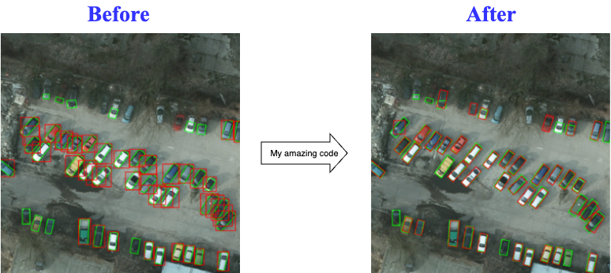

# YOLO-BB2OBB

Convert a **YOLO Object Detection Dataset** with standard **Bounding Box (BB)** annotations to a **YOLO Oriented Bounding Box (OBB)** dataset automatically using **Meta's Segment Anything Model 2 (SAM2)**.



## Installation

1. Follow [Meta's official guide](https://github.com/facebookresearch/sam2) to set up SAM2 as a package and install checkpoints.
2. `cd` to the repo directory:
   ```bash
   cd YOLO-BB2OBB

3. Install the required dependencies from the `requirements.txt` file:
   ```bash
   pip install -r requirements.txt
   ```

### Usage

```bash
python obb.py <dataset_path> <output_path> [OPTIONS]
```

### Arguments

| Argument            | Type   | Default Value                                                   | Description |
|--------------------|--------|-----------------------------------------------------------------|-------------|
| `dataset_path`     | `str`  | Required                                                       | Path to the dataset containing `train/val/test` sets. |
| `output_path`      | `str`  | Required                                                       | Path to save the generated OBB dataset. |
| `--model_cfg`      | `str`  | `"configs/sam2.1/sam2.1_hiera_l.yaml"`                         | Path to the SAM2 model configuration file. |
| `--checkpoint_path`| `str`  | `"~/sam2/checkpoints/sam2.1_hiera_large.pt"`                   | Path to the SAM2 model checkpoint. |
| `--device`         | `str`  | `"cpu"`                                                     | Device to run the model on (e.g., `cuda:0`, `cuda:1`, or `cpu`). |
| `--use_max_contour`| `bool` | `False`                                                        | Whether to use only the max contour to generate OBBs. If `False`, the whole mask is used. |

### Example

```bash
python obb.py /path/to/dataset /path/to/output \
    --model_cfg configs/sam2.1/sam2.1_hiera_l.yaml \
    --checkpoint_path ~/sam2/checkpoints/sam2.1_hiera_large.pt \
    --device cuda:0 \
    --use_max_contour True
```

### Notes

- Ensure that the SAM2 model configuration and checkpoint files are correctly specified.
- If running on a GPU, set the `--device` argument accordingly (e.g., `cuda:0`).
- If `--use_max_contour` is set to `True`, only the largest contour in the mask will be used for OBB generation.
## Description

This script utilizes **Meta's SAM2** to refine standard bounding boxes into oriented bounding boxes, improving object detection accuracy in YOLO models that support OBB annotations.

## Requirements

- Python 3.x
- Meta's SAM2
- Dependencies from `requirements.txt`

## Acknowledgments

Shout out to **YOLO by Ultralytics** for their incredible work advancing object detection models and to mindkosh for the image above. Shout out to my mom and Ronaldo also.


